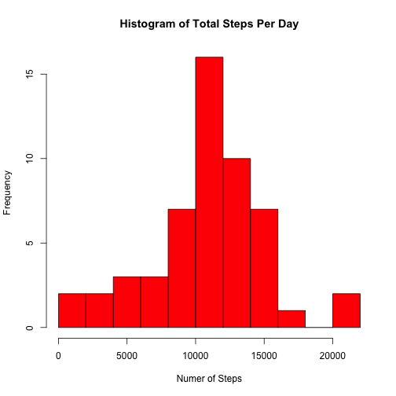
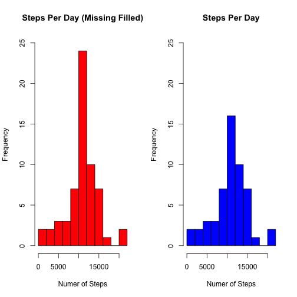

# Reproducible Research: Peer Assessment 1


This assignment uses data from a personal activity monitoring device to highlight the use of R markdown and knitr to create readable reports. The activity monitoring data is solely focused on personal movement, and is from a single individual over the course of **61 unique days**. The monitoring device registers the number of steps taken for each 5 minute interval throughout the day.

The analysis will focus on understanding daily activity patterns of this individual over this 2 month period.


## Loading and preprocessing the data


I'll start the analysis by loading all of the packages used throughout.


```r
library(lubridate)
library(ggplot2)
library(lattice)
library(reshape2)
library(psych)
library(knitr)
```


The data resides in CSV file (included in the Github repository), so I'll start by reading in the data and manipulating the variables to fit our analysis.


```r
data <- read.csv('activity.csv')
data[,'date'] <- ymd(data[,'date'])
kable(head(data),padding=2)
```


|  steps|date        |  interval|
|------:|:-----------|---------:|
|     NA|2012-10-01  |         0|
|     NA|2012-10-01  |         5|
|     NA|2012-10-01  |        10|
|     NA|2012-10-01  |        15|
|     NA|2012-10-01  |        20|
|     NA|2012-10-01  |        25|


It looks like there are quite a few NA values included in the data. We'll have to address this later in our analysis.


## What is mean total number of steps taken per day?


First we looking to determine measures of central tendency (mean, median) for the number of steps taken per day. I'll start by creating a data set containing the sum of total steps taken throughout the day with NA values removed.


```r
data.melt <- melt(data,id=c('interval','date'),measure.vars='steps',na.rm=TRUE)
data.dcast <- dcast(data.melt,date~variable,sum)
kable(head(data.dcast),padding=2)
```


|date        |  steps|
|:-----------|------:|
|2012-10-02  |    126|
|2012-10-03  |  11352|
|2012-10-04  |  12116|
|2012-10-05  |  13294|
|2012-10-06  |  15420|
|2012-10-07  |  11015|


Next I'll plot a histogram of total steps for day and get summary statistics for the number of steps.


```r
hist(data.dcast$steps,col='red',breaks=10,main='Histogram of Total Steps Per Day',xlab='Numer of Steps')
```

 

```r
kable(describe(data.dcast$steps),padding=2)
```


|  vars|   n|   mean|    sd|  median|  trimmed|   mad|  min|    max|  range|     skew|  kurtosis|     se|
|-----:|---:|------:|-----:|-------:|--------:|-----:|----:|------:|------:|--------:|---------:|------:|
|     1|  53|  10766|  4269|   10765|    10940|  3140|   41|  21194|  21153|  -0.3016|    0.5913|  586.4|


As seen above, he mean value for number of steps per day is **10766** and the median value is **10765**.


## What is the average daily activity pattern?


Now that we have an understanding of central tendency for number of steps per day, let's look into activity patterns throughout the day using the interval variable. I'll start by building a data set containing the average value for each 5 minute interval across all 61 days. Again we will be using our initial "melted" data set that has NA values removed.


```r
data.interval.dcast <- dcast(data.melt,interval~variable,mean)
kable(head(data.interval.dcast),padding=2)
```


|  interval|   steps|
|---------:|-------:|
|         0|  1.7170|
|         5|  0.3396|
|        10|  0.1321|
|        15|  0.1509|
|        20|  0.0755|
|        25|  2.0943|


Now I'll construct a time-series plot with the average value per interval. This plot also highlights the 5 minute interval with the maximum average number of steps in our data set.


```r
max.row <- which(data.interval.dcast$steps == max(data.interval.dcast[,'steps']))
ggplot(data.interval.dcast,aes(interval,steps)) + 
  geom_line() + 
  geom_point(data=data.interval.dcast[max.row,],shape=15,colour="red", size=5) +
  geom_text(data=data.interval.dcast[max.row,], 
            label=paste('Max @ Interval ',
                        toString(data.interval.dcast[max.row,'interval'])), 
            hjust=1.1,col='blue') +
  ylab('Number of Steps') +
  xlab('Time Interval') +
  ggtitle('Average Number of Steps Per Time Interval')
```

 


We can see the max number of steps at interval 835.


## Imputing missing values


As we saw when we first looked at the data, we might have an issue with NA values that we need to address. I'll start by addresssing how many rows have NA values.


```r
nrow(data) - sum(complete.cases(data))
```

```
## [1] 2304
```


We have 2304 rows in our data set containing at least one NA value. Let's see how that is spread across our variables.


```r
sapply(data, function(x) sum(is.na(x)))
```

```
##    steps     date interval 
##     2304        0        0
```


Looks like the NA values are only contained in our steps variable, meaning this is most likely some sort of measurement issue and not an underlying issue with our data set. Now I'm going to replace all of these NA values with the mean value associated with the same interval.


```r
data.filled <- data
for (interval in unique(data.filled$interval)) {
  val <- data.interval.dcast[data.interval.dcast == interval,'steps'][1]
  data.filled[data.filled$interval == interval & is.na(data.filled$steps),'steps'] <- val
}
sapply(data.filled, function(x) sum(is.na(x)))
```

```
##    steps     date interval 
##        0        0        0
```


Now that I've replaced these NA values, I want to see how this affected our measures of central tendency calculated earlier in the analysis. I'll start by creating a new data set containing the total steps for each with this filled data set (replaced NA values).


```r
data.filled.melt <- melt(data.filled,id=c('interval','date'),measure.vars='steps')
data.filled.dcast <- dcast(data.filled.melt,date~variable,sum)
kable(head(data.filled.dcast),padding=2)
```


|date        |  steps|
|:-----------|------:|
|2012-10-01  |  10766|
|2012-10-02  |    126|
|2012-10-03  |  11352|
|2012-10-04  |  12116|
|2012-10-05  |  13294|
|2012-10-06  |  15420|


Below is a histogram highlighting the distribution of steps in this new data set with NA values filled. Summary statistics for steps are also below.


```r
hist(data.filled.dcast$steps,col='red',breaks=10,main='Histogram of Total Steps Per Day',xlab='Numer of Steps')
```

 

```r
kable(describe(data.filled.dcast$steps),padding=2)
```


|  vars|   n|   mean|    sd|  median|  trimmed|   mad|  min|    max|  range|     skew|  kurtosis|     se|
|-----:|---:|------:|-----:|-------:|--------:|-----:|----:|------:|------:|--------:|---------:|------:|
|     1|  61|  10766|  3974|   10766|    10947|  2854|   41|  21194|  21153|  -0.3248|     1.154|  508.9|


As seen above, the mean value across all days has remained the same at **10766** steps, but now the median value has also moved to **10766** as well (up from **10765** in our data set with NA values). The standard error and standard deviation values have also shrunk significantly. It seems that this replacement technique has led to significant clustering around the mean. I'm going to plot histograms of both data sets to better get a sense of how this affected the distribution of total steps per day. I've also included summary statistics for both data sets side by side.


```r
par(mfrow=c(1,2))
hist(data.filled.dcast$steps,col='red',
     breaks=10,main='Steps Per Day (Missing Filled)',xlab='Numer of Steps',ylim=c(0,25))
hist(data.dcast$steps,col='blue',
     breaks=10,main='Steps Per Day',xlab='Numer of Steps',ylim=c(0,25))
```

 

```r
kable(describe(data.filled.dcast$steps),padding=2)
```


|  vars|   n|   mean|    sd|  median|  trimmed|   mad|  min|    max|  range|     skew|  kurtosis|     se|
|-----:|---:|------:|-----:|-------:|--------:|-----:|----:|------:|------:|--------:|---------:|------:|
|     1|  61|  10766|  3974|   10766|    10947|  2854|   41|  21194|  21153|  -0.3248|     1.154|  508.9|

```r
kable(describe(data.dcast$steps),padding=2)
```


|  vars|   n|   mean|    sd|  median|  trimmed|   mad|  min|    max|  range|     skew|  kurtosis|     se|
|-----:|---:|------:|-----:|-------:|--------:|-----:|----:|------:|------:|--------:|---------:|------:|
|     1|  53|  10766|  4269|   10765|    10940|  3140|   41|  21194|  21153|  -0.3016|    0.5913|  586.4|


Here we can see the heavy clustering around the mean as a result of the technique use to fill missing values.


## Are there differences in activity patterns between weekdays and weekends?


Now I'll evaluate if if there are any general differences between activity patterns on weekdays and weekdays. I'll start by getting the individual day names using the date variable, then assigning them "weekday" or "weekend" labels.


```r
data.filled$dayNames <- wday(data.filled$date, label = TRUE, abbr = TRUE)
data.filled$weekend <- ifelse(data.filled$dayNames %in% c('Mon','Tues','Wed','Thurs','Fri'),'Weekday','Weekend')
```

Next I'll set up the data set to contain the average number of steps per 5 minute interval across both weekends and weekdays.


```r
data.filled.weekday.melt <- melt(data.filled,id=c('interval','date','dayNames','weekend'),measure.vars='steps')
data.filled.weekday.dcast <- dcast(data.filled.weekday.melt,interval+weekend~variable,mean)
```

Now I'll plot this data so we can evaluate the differences in average activity across weekdays and weekends.


```r
xyplot(steps ~ interval | weekend,
       data=data.filled.weekday.dcast,layout=c(1,2),
       type="l",main='Average Number of Steps Per Interval')
```

 

As seen above, it looks like there is a heavy activity (steps) spike during weekday mornings, possibly coinciding with this indivduals trip to work. Weekend activity looks more evenly distributed throughout the day, and total activity seems to be greater on average during weekends.

Hope you enjoyed reading through the document. Please feel free to comment!
